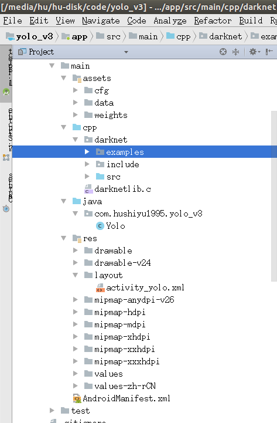
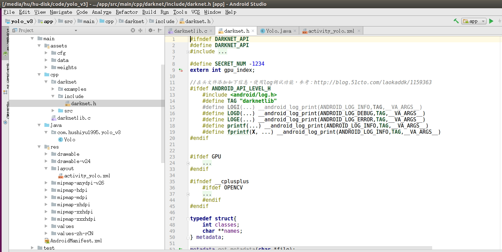
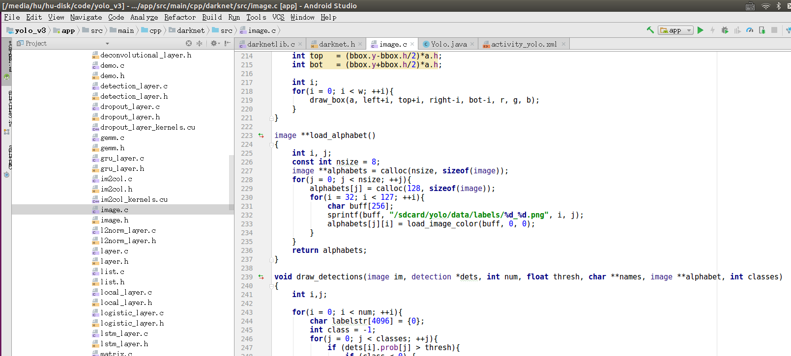
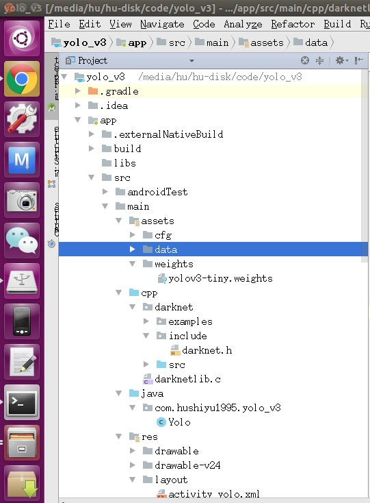
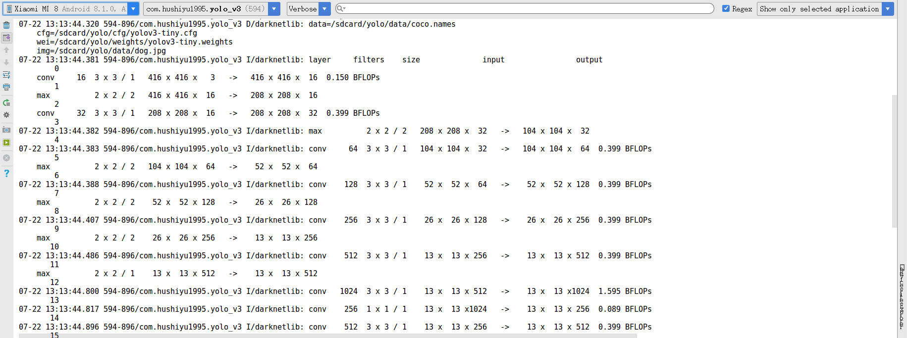
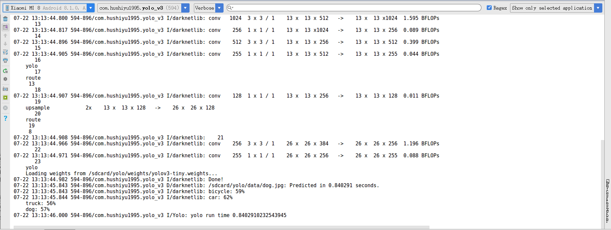
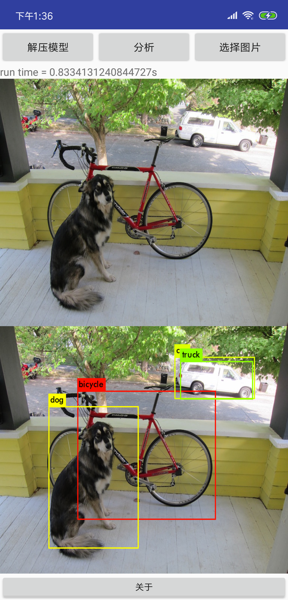

# I. Introduction

This project will develop and compile the source code of Yolo-v3 in android studio and deploy it to android mobile phone to realize the call of Yolo-v3 network by using mobile phone hardware platform. The project is developed with Yolo-v3-tiny as an example. Other related networks can be reproduced by downloading weight files from the Darknet website.

# II. Development Environment

OS: Ubuntu 16.04

Android Studio: 3.1.3

Mobile Phone: Xiaomi MI 8

Related tutorials:

[Install AndroidStudio method under Ubuntu] (https://blog.csdn.net/qibin0506/article/details/50755202)

[Andorid Studio official website installation tutorial] (https://developer.android.com/studio/install?hl=en)

Please check the tutorial to complete the Android Studio installation and configuration of the NDK, SDK and other related development environments.

# III. Project Construction

## 3.1 Source Import
Build a project that supports C in Andorid Studio and download the source code from [Darknet] (https://github.com/pjreddie/darknet).

Create a new darknet folder in the project project's cpp folder, and copy the example, include, src folders in the downloaded source code to the android project.

## 3.2 Source code modification

### 3.2.1 include folder

The header file of the darknet is placed under the include folder, and the log debugging function is added at the beginning of the header file.

### 3.2.2 src folder

The src folder is placed in the darknet source. First, delete the compare.c file (compare.c has no header file, which does not work for the compilation of the entire library. If you do not delete it, compare.c will have a pointer problem at compile time. ). Then modify the image.c file, change the label path in the 232-line load_alphabet() function to sdcard/yolo/data/labels (this is the absolute path that will be placed on the phone later, if you don't make changes, then the real machine test There will be a problem that the labels cannot be imported, resulting in a flashback phenomenon).

## 3.2 Cmake file configuration

For the format and usage of Cmake, please refer to:

[Official Guide] (https://cmake.org/cmake/help/v3.12/manual/cmake.1.html)

[Basic use of CMake] (https://www.jianshu.com/p/a5bb1db05967)

[cmake basic commands & cross-compilation configuration & module writing] (https://blog.csdn.net/GW569453350game/article/details/46683845)

[cmake's usage notes] (https://blog.csdn.net/cartzhang/article/details/21518253)

For the Cmake configuration information in this project, please refer to the CMakeLists.txt file in the code.

### 3.3 asserts folder configuration

Place the cfg,data file in the darknet source code in the assert folder of the project.

Download the [YOLOV3-tiny](https://pjreddie.com/media/files/yolov3-tiny.weights) weight file from [official website] (https://pjreddie.com/darknet/yolo/) and place it in the weights file. Under the folder.

### 3.4 JNI Interface Configuration

For details on how to build a JNI project in Android Studio 3, please refer to [Android Jni/NDK Development Getting Started] (https://www.jianshu.com/p/b294b3878192).

This project mainly modifies the darknetlib.c file. The image test code is taken from the official code example of darknet/examples/dector.c Line562~Line626. Please refer to the project code and comments for details.

Where datacfg_str and name_list = "/sdcard/yolo/data/coco.names" is because the pre-training model used by the project comes from [official website] (https://pjreddie.com/darknet/yolo/), where yolo- V3-tiny is an 80-class model trained with the coco training set, so the name_list needs to be consistent with the pre-training model.

Cfgfile_str and weightfile_str place the address of the cfg file and the weight file, which can be consistent according to the location of the downloaded file.

### 3.5 Java Configuration

Modify the Yolo.java under the java folder to complete the relevant configuration.

IV. Project operation

Run the project on Xiaomi 8, you can see the file information read in the logcat of android studio 3, and the configuration of Yolo-v3-tiny network.

Logcat will print out the predicted object name, probability and processing time.

Tested on different pictures, using a mobile phone CPU to process about a picture takes 0.8s.

# 参考

Project reference [Darknet yolo porting and implementation in android studio] (https://blog.csdn.net/chentyjpm/article/details/79326118), the original blogger realized the transplantation of Yolo-v2, this project is modified After the implementation of the Yolo-v3 version of the code, the Android side reappears.
